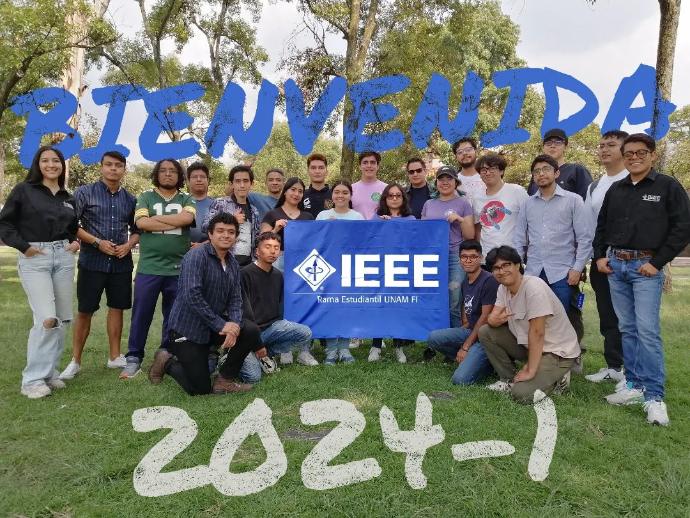
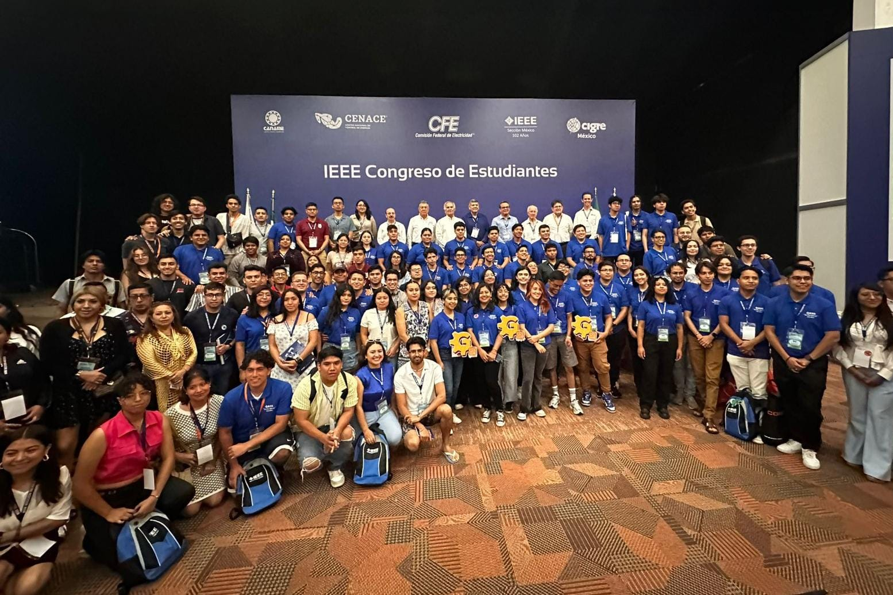

# IEEE UNAM

IEEE UNAM FI es la rama estudiantil del Instituto de Ingenieros Eléctricos Electrónicos en la Facultad de Ingeniería de la UNAM.

Fomentamos el desarrollo profesional y académico en ingeniería eléctrica, electrónica y áreas afines a través de eventos, talleres, cursos, proyectos y networking.

> *Promoviendo la innovación y excelencia tecnológica.*

Únete a nosotros y forma parte de una comunidad comprometida con la innovación y el desarrollo profesional.

### Misión

Impulsar el crecimiento profesional, académico y personal de los y las estudiantes de ingeniería mediante la colaboración e intercambio de conocimientos, complementando su formación con el objetivo de crear innovacion tecnologica en beneficio a la humanidad.

### Visión

Ser líderes en innovación y desarrollo tecnológico, reconocidos por la calidad de nuestros proyectos, competencias, eventos y otras actividades.

## Actividades 

- **Eventos y Conferencias**: Charlas con expertos de la industria.
- **Talleres y Cursos**: Desarrollo de habilidades técnicas.
- **Proyectos Innovadores**: Investigación, desarrollo y exposición en eventos a nivel nacional e internacional.
- **Networking**: Conexiones con estudiantes y profesionales al rededor del mundo.

## Capítulos 

- [IEEE CS](https://www.instagram.com/ieee.cs.unam/)
- [IEEE EMBS](https://www.instagram.com/unam_ieee_embs/)
- [IEEE WIE](https://www.instagram.com/wie_unam_ieee/)
- [IEEE PES](https://www.instagram.com/ieee.unam_pes/)
- [IEEE CAS](https://www.instagram.com/unam.ieee.cas/)
- [IEEE AESS](https://www.instagram.com/unam.ieee.aess/)

## Siguenos en nuestras redes

- [Instagram](https://www.instagram.com/ieee_unam_fi/)
- [Facebook](https://www.facebook.com/IEEE.UNAM)
- [Linkedin](https://www.linkedin.com/company/ieeeunamfi/)